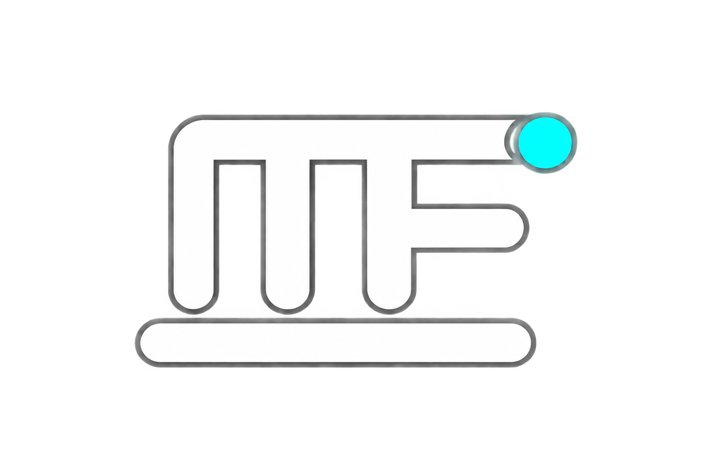
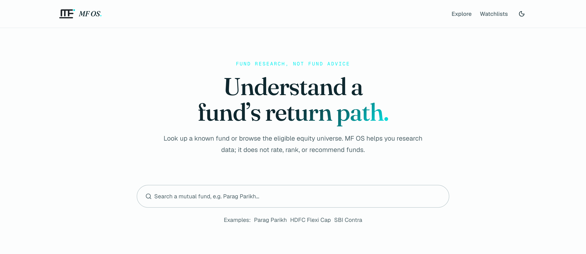
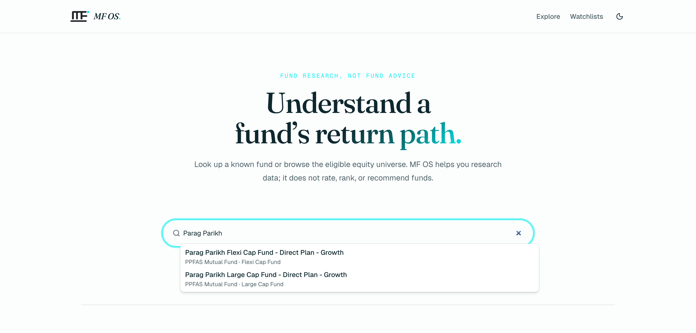
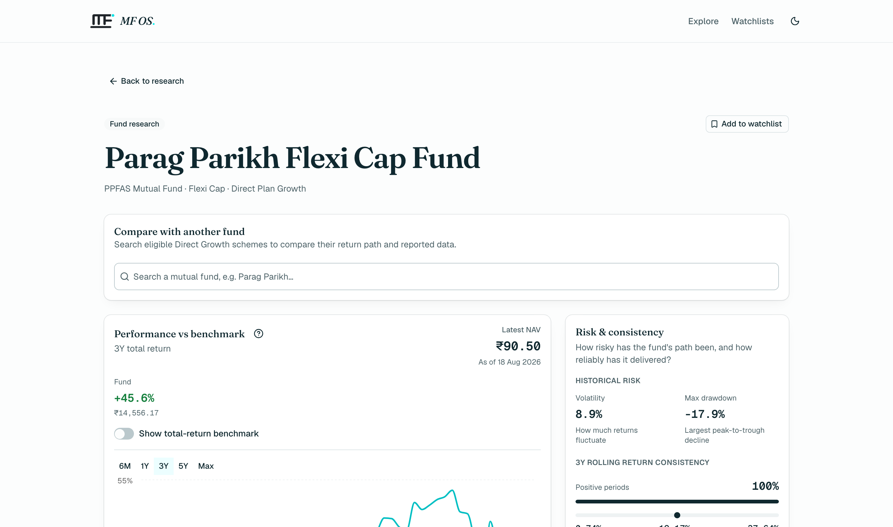
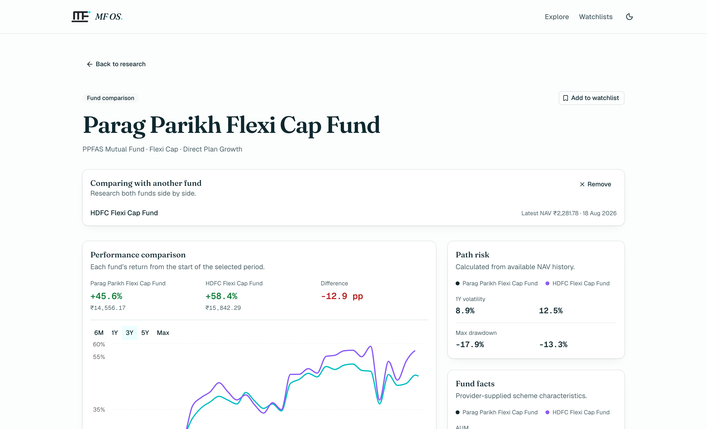
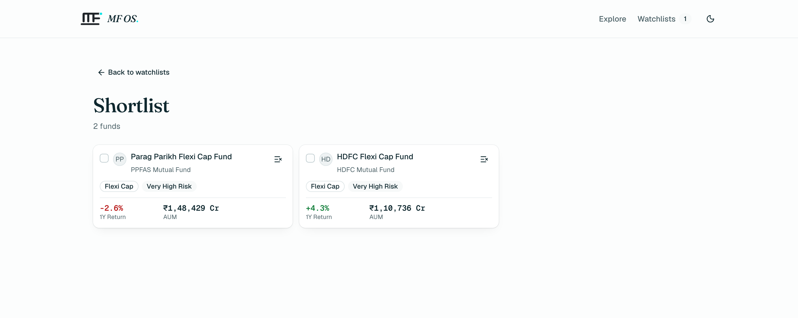

  <picture>
    <source media="(prefers-color-scheme: dark)" srcset="public/logo-light.png">
    <source media="(prefers-color-scheme: light)" srcset="public/logo-dark.png">
    
  </picture>

<h1 align="center">MF OS</h1>

<strong>Mutual fund research without verdicts.</strong>

  Research active Direct Growth Indian equity funds, compare what matters, 
  and inspect the underlying data without turning analysis into a recommendation.

  <a href="https://mfops.netlify.app/"><strong>Open MF OS →</strong></a>
  &nbsp;·&nbsp;
  <a href="docs/development.md">Documentation</a>
  &nbsp;·&nbsp;
  <a href="docs/architecture.md">Architecture</a>

  

<!--
  TODO: docs/readme/hero.png and the section images below don't exist yet.
  Compose them per DESIGN.md — Fraunces headings, Geist Mono metric labels,
  storm neutrals, #02eff0 accent used sparingly — over real app screenshots.
-->

---

### Built for due diligence, not persuasion

MF OS gives distributors a structured research surface for understanding a
fund's performance, risk, portfolio, and peer context.

**It presents evidence. You make the judgement.**

---

### 01 · Find

Move through the fund universe quickly.

Search by scheme, browse categories, or jump directly using an ISIN.

### 02 · Research

Look past headline returns.

NAV history · return metrics · risk metrics · fund facts · portfolio holdings
· AMC context · peer funds

### 03 · Compare

Put two funds on the same frame.

Compare normalized return paths and supporting metrics without reducing the
result to a winner.

### 04 · Watch

Build a research shortlist.

Save funds into browser-local watchlists and return to them later — no
account needed.

---

### Research, without manufactured certainty

MF OS deliberately doesn't rank funds, assign a winner, or turn a collection
of metrics into a recommendation.

Returns are returns. Risk metrics are risk metrics. Portfolio data is
portfolio data. The product gives you the evidence and context due diligence
requires, and keeps the judgement with you.

### Data should admit when it doesn't know

Missing, stale, or unavailable data is surfaced explicitly rather than
silently substituted or inferred.

[Data & limitations →](https://mfops.netlify.app/data-and-limitations)

---

## Under the hood

MF OS is a Next.js application built around explicit provider boundaries and
normalized financial-data contracts.

- [docs/architecture.md](docs/architecture.md) — request flow, provider
  boundaries, and data contracts.
- [docs/development.md](docs/development.md) — local setup, environment
  configuration, and the checks to run before opening a pull request.
- [DESIGN.md](DESIGN.md) — visual and content conventions.
- [AGENTS.md](AGENTS.md) — product boundaries and working rules for
  contributors and coding agents.

## Status

